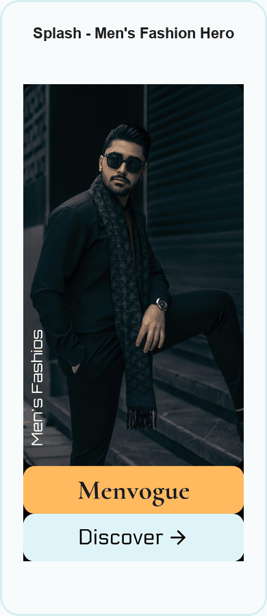
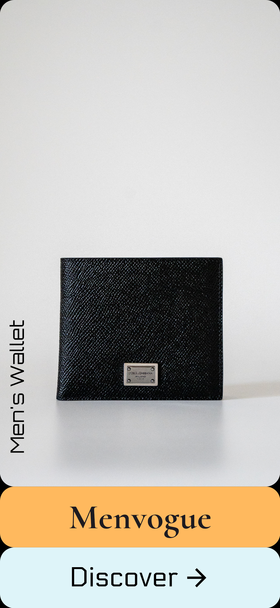
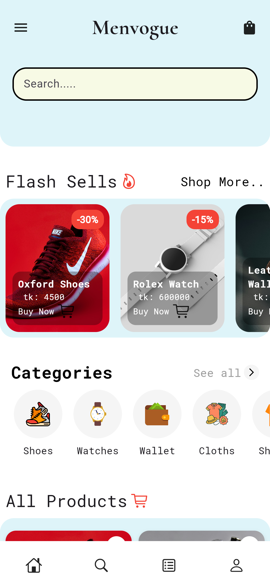
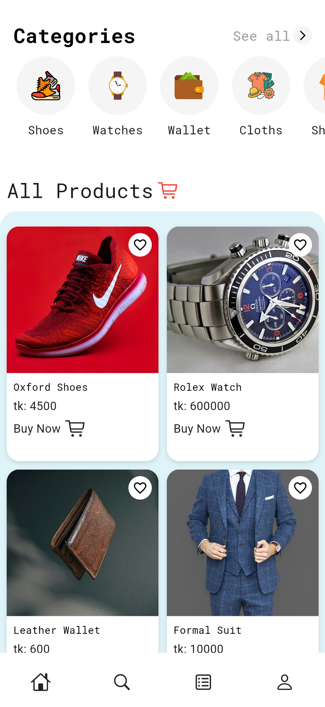
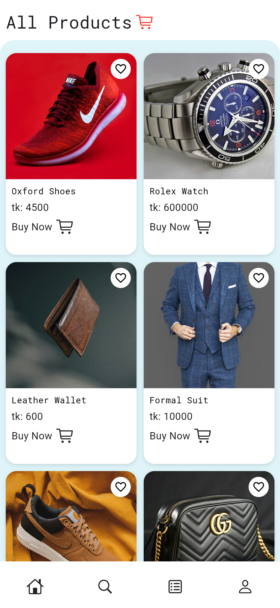
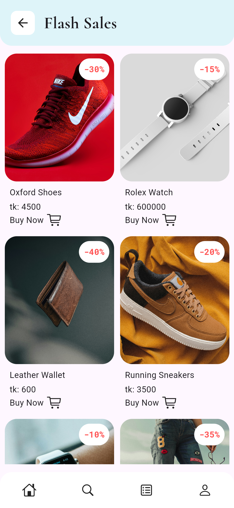
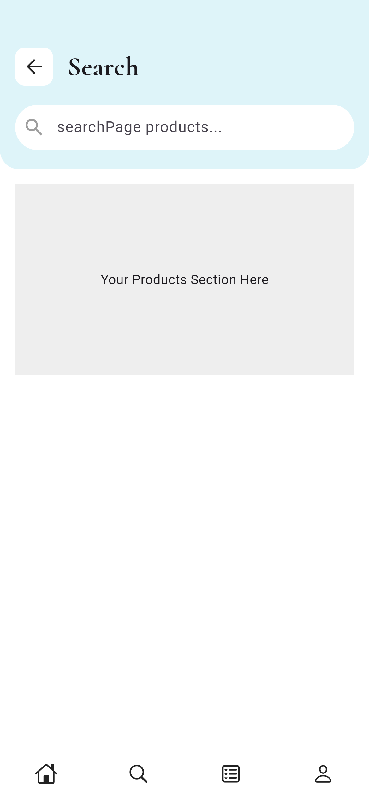
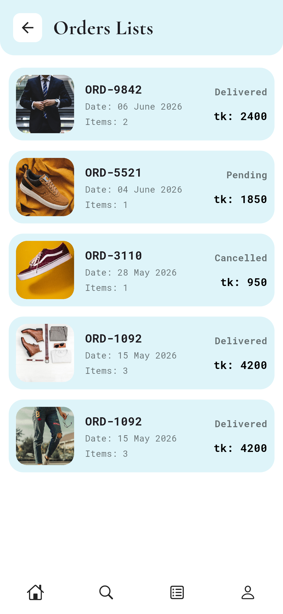
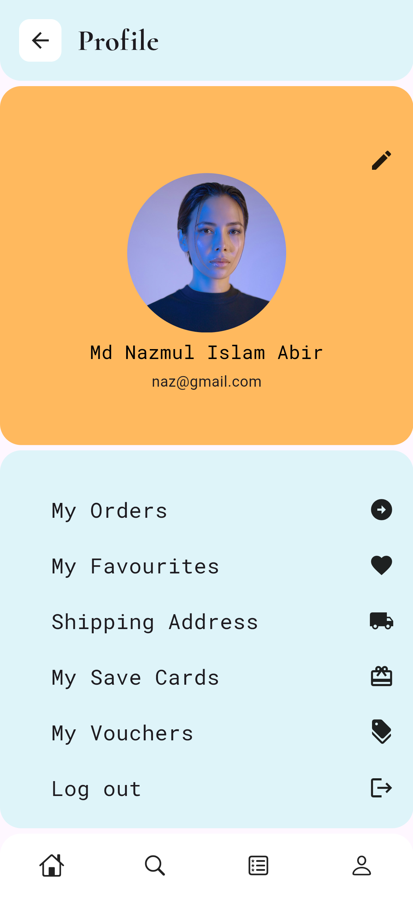

# Menvogue

Menvogue is a Flutter men's fashion e-commerce app with a mobile-first shopping experience, product catalog, flash sales, order history, profile screen, and Supabase REST API integration.

<p align="center">
  
</p>

## Screenshots Slideshow

The slideshow above cycles through every screenshot stored in `assets/ss`. Each slide includes a title describing what the screen shows.

## Screenshot Gallery

<table>
  <tr>
    <td align="center" width="33%">
      <strong>Splash - Men's Fashion Hero</strong><br/>
      
    </td>
    <td align="center" width="33%">
      <strong>Splash - Men's Shoes Hero</strong><br/>
      
    </td>
    <td align="center" width="33%">
      <strong>Splash - Men's Wallet Hero</strong><br/>
      
    </td>
  </tr>
  <tr>
    <td align="center" width="33%">
      <strong>Home Dashboard</strong><br/>
      
    </td>
    <td align="center" width="33%">
      <strong>Product Catalog Overview</strong><br/>
      
    </td>
    <td align="center" width="33%">
      <strong>Product Catalog Scroll</strong><br/>
      
    </td>
  </tr>
  <tr>
    <td align="center" width="33%">
      <strong>Flash Sales Listing</strong><br/>
      
    </td>
    <td align="center" width="33%">
      <strong>Search Screen</strong><br/>
      
    </td>
    <td align="center" width="33%">
      <strong>Orders List</strong><br/>
      
    </td>
  </tr>
  <tr>
    <td align="center" width="33%">
      <strong>Profile Screen</strong><br/>
      
    </td>
    <td></td>
    <td></td>
  </tr>
</table>

## Features

- Splash/onboarding screens for men's fashion, shoes, and wallet collections
- Home dashboard with search, flash sale preview, categories, and product grid
- Flash sales page with discount badges and buy actions
- Product catalog cards with images, prices, favorite icons, and cart actions
- Search screen layout for product discovery
- Order list with order ID, date, item count, status, and total price
- Profile screen with user details and account menu options
- Bottom navigation for Home, Search, Orders, and Profile

## Tech Stack

- Flutter
- Dart
- Supabase REST API
- HTTP package
- Google Fonts
- Cupertino and Material icons

## API Endpoints

The app fetches product, flash sale, and order data from Supabase REST endpoints.

```http
GET /rest/v1/products
GET /rest/v1/flashsale
GET /rest/v1/myorders
```

## Project Structure

```text
lib/
  main.dart
  screens/
    app.dart
    dashboard.dart
    flashsale.dart
    list.dart
    profile.dart
    search.dart
    splash.dart
assets/
  icons/
  ss/
```

## Setup

```bash
flutter pub get
flutter run
```

## Build

```bash
flutter build apk --release
flutter build web
```

## Learning Objectives

- Build a Flutter e-commerce interface
- Display remote data from Supabase REST API
- Parse JSON responses into UI lists and grids
- Use reusable mobile navigation patterns
- Present product, order, and profile screens in a complete shopping flow
