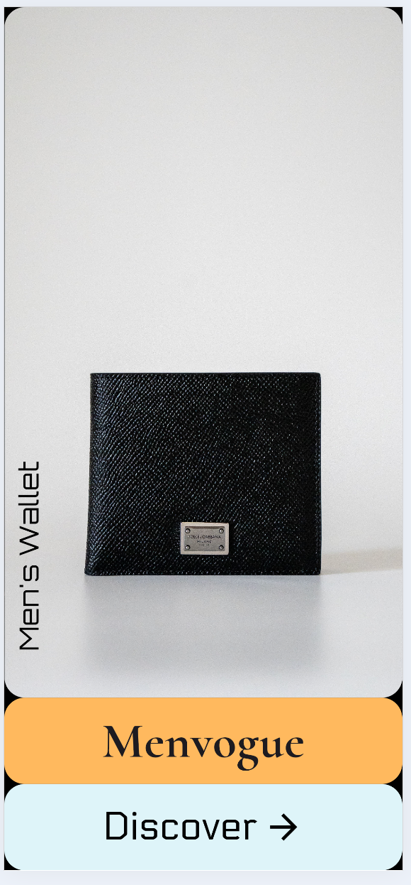
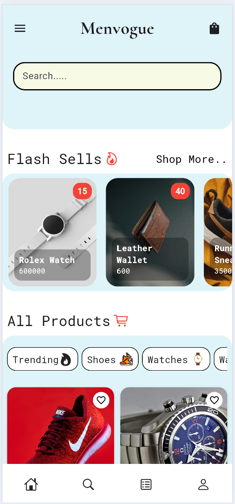
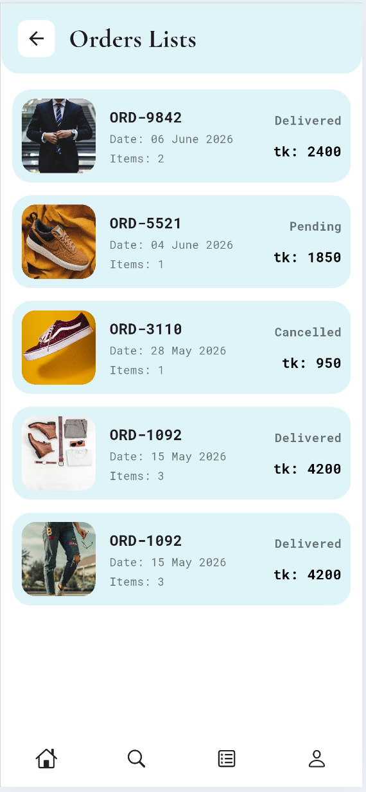
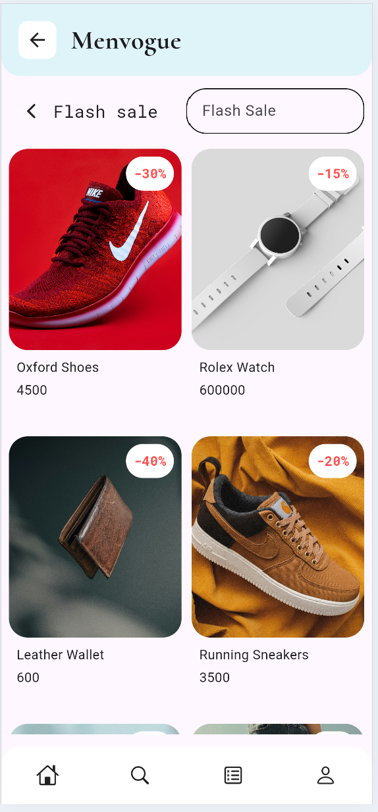
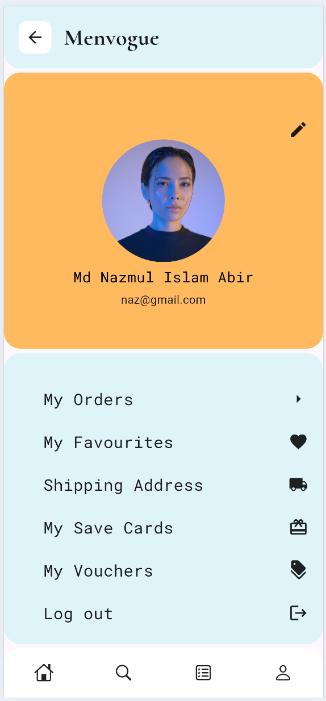
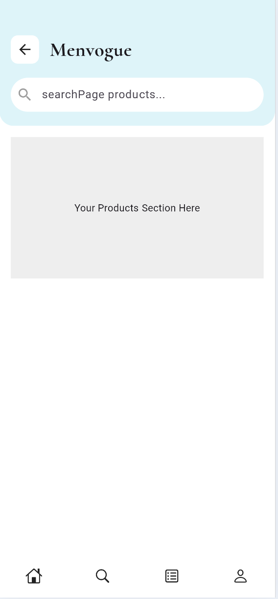
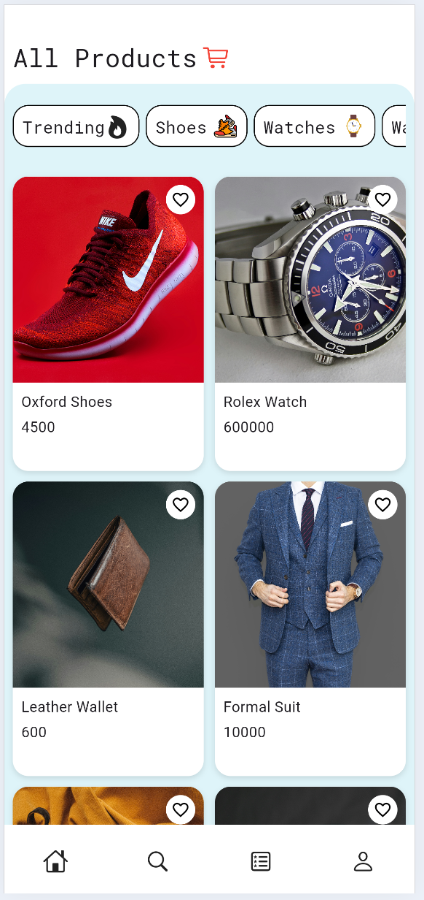

# Menvogue 👔

A modern Flutter-based men's fashion e-commerce application integrated with Supabase REST API.


<div align="center">
  
  
  
  
  <br/>
  
  
  
  
  <br/>
  <em>Menvogue - Modern Men's Fashion E-Commerce App</em>
</div>

## ✨ Features

### 🏠 Home Dashboard

* Modern UI design
* Product categories
* Flash sale section
* Product grid layout
* Responsive design

### 🔥 Flash Sales

* Featured products
* Discount badges
* Horizontal scrolling cards
* Real-time data from Supabase

### 🛍️ Product Catalog

* Product image
* Product name
* Product price
* Product ratings
* Category filtering
* Grid view layout

### 🔍 Search

* Product search interface
* Quick product discovery
* User-friendly navigation

### 📦 Order Management

* View all orders
* Order status tracking
* Order history
* Product thumbnails
* Order date display
* Total price calculation
* Item count tracking

### 👤 User Profile

* Profile management page
* User account section

---

## 🛠️ Technologies Used

* Flutter
* Dart
* Supabase
* REST API
* HTTP Package
* Google Fonts

---

## 🗄️ Database Tables

### Products Table

| Column        | Type    |
| ------------- | ------- |
| id            | bigint  |
| name          | text    |
| price         | integer |
| image         | text    |
| rating        | numeric |
| category      | text    |
| is_flash_sale | boolean |
| discount      | text    |

### Orders Table (myorders)

| Column      | Type    |
| ----------- | ------- |
| order_id    | text    |
| image_url   | text    |
| date        | text    |
| items_count | integer |
| status      | text    |
| total_price | integer |

---

## 🔌 API Integration

### Products API

```http
GET /rest/v1/products?select=*
```

### Flash Sale Products

```http
GET /rest/v1/products?is_flash_sale=eq.true
```

### Orders API

```http
GET /rest/v1/myorders
```

The application uses Supabase REST API endpoints and retrieves data through HTTP requests.

---

## 🏗️ Architecture

```text
Flutter App
     │
     ▼
HTTP Requests
     │
     ▼
Supabase REST API
     │
 ┌───┴──────────┐
 ▼              ▼
Products      Orders
Table         Table
```

---

## 📱 Screens

* Dashboard Screen
* Search Screen
* Order List Screen
* Profile Screen

---

## 🚀 Future Improvements

* User Authentication
* Shopping Cart
* Wishlist
* Checkout Flow
* Payment Gateway Integration
* Push Notifications
* Product Reviews
* Order Tracking Timeline
* Admin Dashboard

---

## ⚙️ Setup

```bash
flutter pub get
flutter run
```

### Build APK

```bash
flutter build apk --release
```

### Build Web

```bash
flutter build web
```

---

## 📚 Learning Objectives

This project demonstrates:

* Flutter UI Development
* REST API Integration
* Cloud Database Management
* State Management with StatefulWidget
* JSON Parsing
* HTTP Requests
* Supabase Backend Integration
* E-commerce Application Design

---

## 👨‍💻 Developer

Developed as a learning project to explore Flutter application development and cloud backend integration using Supabase.
